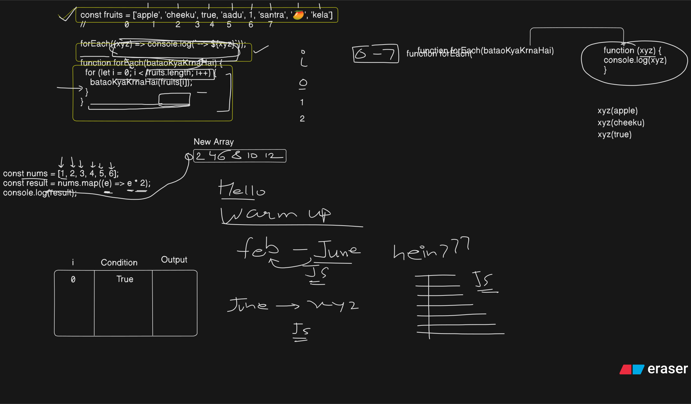

## 📥 Reference Links & Attachments

**Week 05 · Class 12 – JS for Beginers**

---

## 🔗 Official Resources

### ✍️ ChaiCode on Erasor 
👉 [JS ChaiCode Workspace](https://app.eraser.io/workspace/i1UCLSD3UwSOUutei0No)

### 📚 Class Attachment svg and png images
👉 

### 📚 Additional Resources
👉 [GitHub Classroom 1](https://classroom.github.com/a/fwCZoRgs)  
👉 [GitHub Classroom 2](https://classroom.github.com/a/LXgTzkVh)  
👉 [GitHub Classroom 3](https://classroom.github.com/a/ARempKK3)  
👉 [GitHub Classroom 4](https://classroom.github.com/a/pZ1cSgDU)  
👉 [GitHub Classroom 5](https://classroom.github.com/a/o2RfZZTy)  

